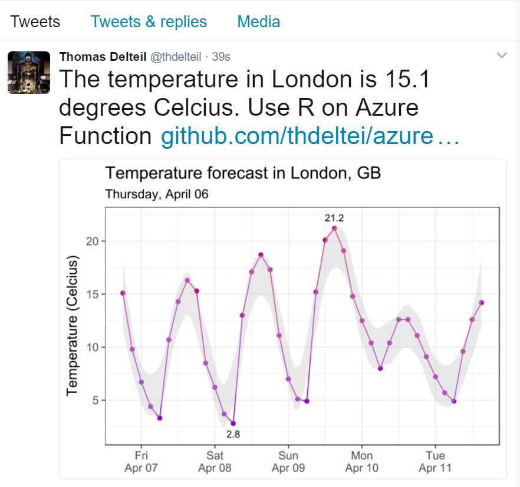
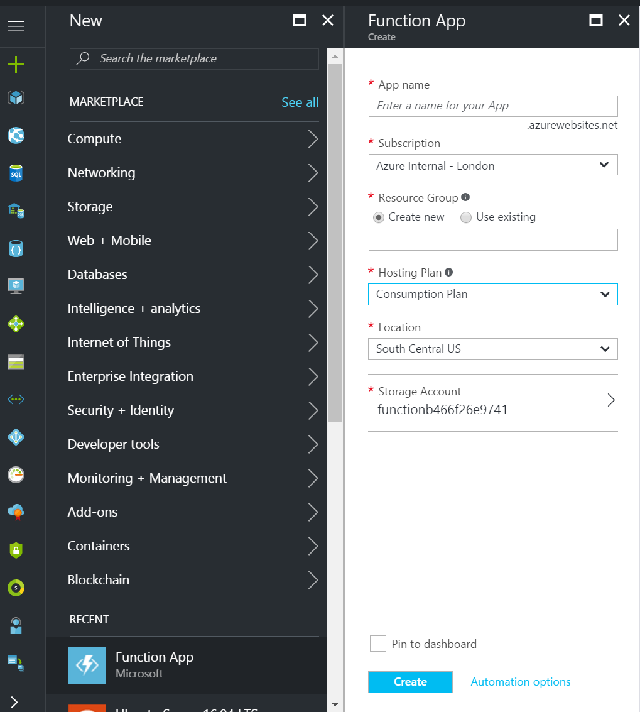
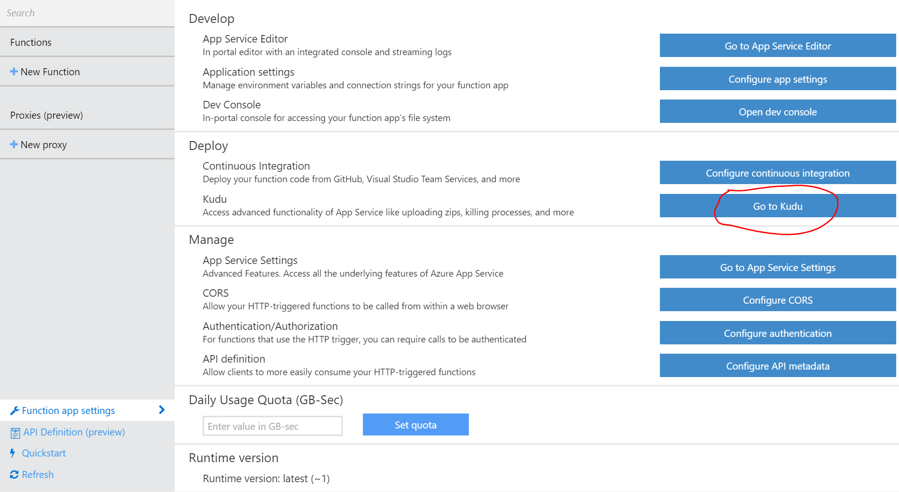
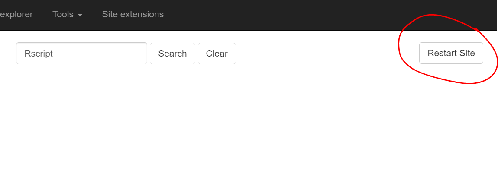
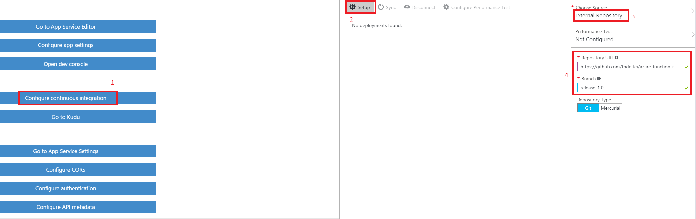
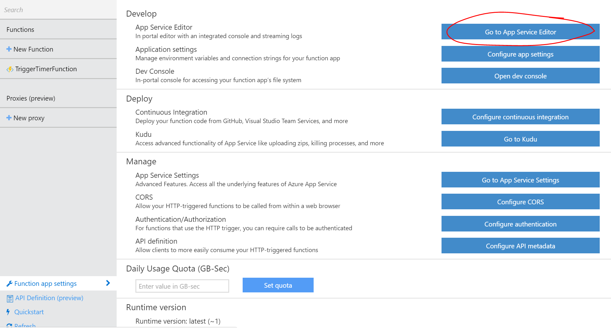

# Running R scripts on Azure Function

In this tutorial we will show how to deploy a script that post daily to twitter the temperature forecast for the next 5 days for a given city.



## Azure Function

[Azure Function](https://azure.microsoft.com/en-us/services/functions/) supports a variety of languages (C#, js, batch, PowerShell, Python). However R is not natively supported, in the following tutorial we will show how to run R scripts on Azure Function.

Azure Function can be used in several scenarios because of the broad choice of triggers it offers:
- Timer trigger, executes a Function on a schedule.
- Http trigger, execute a Function after an HTTP call.
- Azure Queue Storage, Service Bus, Blob Storage, triggers the function when a new object or message is received.

## Creating an Azure Function

1. Make sure you have an Azure Subscription and that you are logged in the [Azure Portal](https://ms.portal.azure.com)

2. Navigate to the [Function creation wizard](https://ms.portal.azure.com/#create/Microsoft.FunctionApp).

3. Pick a name, a resource group, a region and a storage account for your function. The difference between the consumption plan and the hosted plan is price and performance. The consumption plan is much cheaper and in most use cases can be essentially free apart from the storage cost. However it has a 5 minutes execution time limit, and runs slower than the hosted plan. What you chose will depend on your budget and performance requirements. **If you want the twitter bot to tweet the temperature plot, use a hosted plan** 

## Installing the R extension

1. Once you have your Azure Function set up, navigate to the Kudu Console of the function. 

2. Navigate to the site extension tab, search for **Rscript** and install the **R 3.3.3 x64** extension. It can take up to 5 minutes to install on the slower plans. . You might get a `installation failed` pop-up message. Refresh the page and navigate to the `installed` tab. You should see the R extension there.

3. Once the extension is installed, click on **Restart Site** 

4. When the site is back online you can test that R has been properly installed by running `Rscript --help` in the kudu powershell debug console.


## Running a R script on Azure Function

1. You only need to create an Azure Function and call Rscript.exe from powershell. All you need is a R script `script.r` for example, and have a `run.ps1` similar to this:

```
cd D:\home\site\wwwroot\YourFunctionName
D:\home\R-3.3.3\bin\x64\Rscript.exe script.r 2>&1
```

## Running the Azure Function with the temperature forecast twitter bot

### Generating a graph requires a **Hosted Plan**, the bot only tweets text on the **Consumption plan**

1. This repository contains the code for an Azure Function that post to [twitter the temperature forecast for the next 5 days in London](https://twitter.com/thdelteil). The first thing to do is to enable continuous deployment on the function. 

2. You can select external repository and set the address to this repository `https://github.com/thdeltei/azure-function-r` and branch `release-1.0`

3. Click on `sync` and refresh the page. You should see the code in your Azure Function. You might want to disconnect it so that new 

4. The `TriggerTimerFunction` folder contains what is necessary to run a function. There is the `run.ps1` file that is executed when the function is triggered. The `function.json` file defines the triggers, bindings and output of the function. You can read more about them in the [Azure Function documentation](https://docs.microsoft.com/en-us/azure/azure-functions/). The `run.ps1` script contains:
    ```
    cd D:\home\site\wwwroot\script
    D:\home\R-3.3.3\bin\x64\Rscript.exe script.r 2>&1
    ```
    This powershell script change the directory to the `script` directory of this repository and execute the R script while redirecting the stderr to stdout.

### Setting up the keys

1. In order to use the `script.r` file that gets the temperature from the [Open Weather API](https://openweathermap.org/api) and post it to twitter you need:
    - An open weather API key and subscribe to the forecast API. 
    
    - A [twitter developer account](https://dev.twitter.com/), create an App and get the consumer key and secret and a dev access token and secret 
    

2. Once you have that you need to edit the `credentials.json` file on your Azure Function with the right values. You can use the `App Service Editor` for that. 


### Executing the function

1. Click `Run` on the portal 

2. The first time around, the packages are going to be installed and this can take some time (3-4 min), especially on the consumption plan.

3. Enjoy the temperature forecast: 


### Going further

You can make this bot more complex by using an HTTP trigger, reading query string arguments from the environment variables in the R script for example to let the user specify the city and country to generate the forecast for.

### Limitations

The more complex use cases would need some a bit more powershell scripting for example to return an JSON HTTP response, but it consists only of redirecting the stdout of the R process to the normal powershell commands.

The consumption plan has some limitations in terms of graphical libraries that are available. If you find a way around it, let me know! On the hosted plan, vector graphic libraries can be used (svg for e.g) and then converted to .png.

### Acknowledgements

Thanks [Andrie De Vries](https://github.com/andrie) for the help in R and [Mathew Salvaris](https://github.com/msalvaris) for the svg hack.